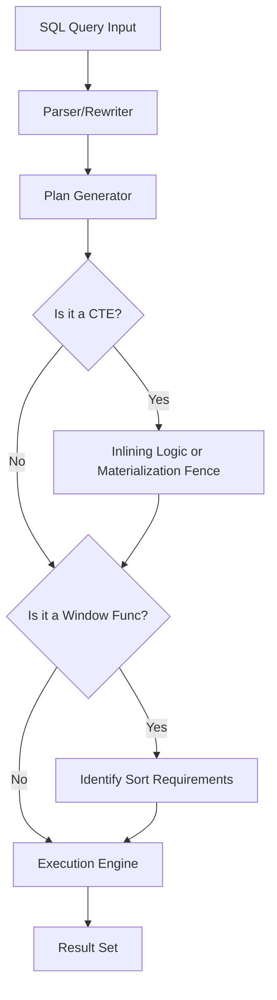

# High-Performance SQL Analytics Benchmarking

This repository contains a high-scale analytics benchmarking suite in PostgreSQL, comparing the performance and execution mechanics of Window Functions versus Common Table Expressions (CTEs).

## Getting Started

Start the environment and automatically seed the database (200,000 users, 1,000,000 orders):
```bash
docker-compose up -d
```
The database uses a healthcheck. The initial seed operation will take a few seconds on first boot.

## Visualizing the Optimizer



## Performance Analysis & Indexes

The benchmarks (detailed in `results.json` and the `benchmarks/` directory) show clear patterns:
- **Unindexed Window Functions**: PostgreSQL will often resort to an `External merge Disk` sort operation when calculating window functions across millions of rows, due to `work_mem` limits.
- **Index Speedups**: Window functions benefit massively from covering indexes (e.g., `orders(user_id, created_at)`) because the planner can skip the expensive sort step entirely and stream rows directly into the window node.

## Materialized Views Strategy

For high-volume dashboards like a 7-day Rolling Revenue tracker, recalculating over 1M rows on every request is inefficient. 
We created `daily_revenue_stats` as a `MATERIALIZED VIEW`.
- Read performance drops from seconds to under a millisecond.
- Write penalties are deferred to background refresh tasks (`REFRESH MATERIALIZED VIEW`), making it ideal when data staleness is acceptable.

## The Recursive Challenge: Why Window Functions Fail

Window functions calculate values over a **Fixed Window**—a static, pre-defined range of rows (like "6 preceding and current row"). They cannot dynamically traverse hierarchical or graph relationships of arbitrary depth.
To find the maximum referral chain depth, we used `WITH RECURSIVE`. This allows PostgreSQL to perform **Variable Depth** traversal, recursively joining the `users.referred_by` column until the chain ends.

> [!NOTE]  
> See `queries/recursive_referrals.sql` for the complete implementation.
